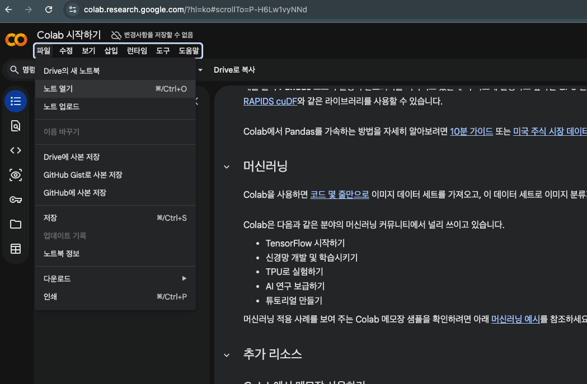
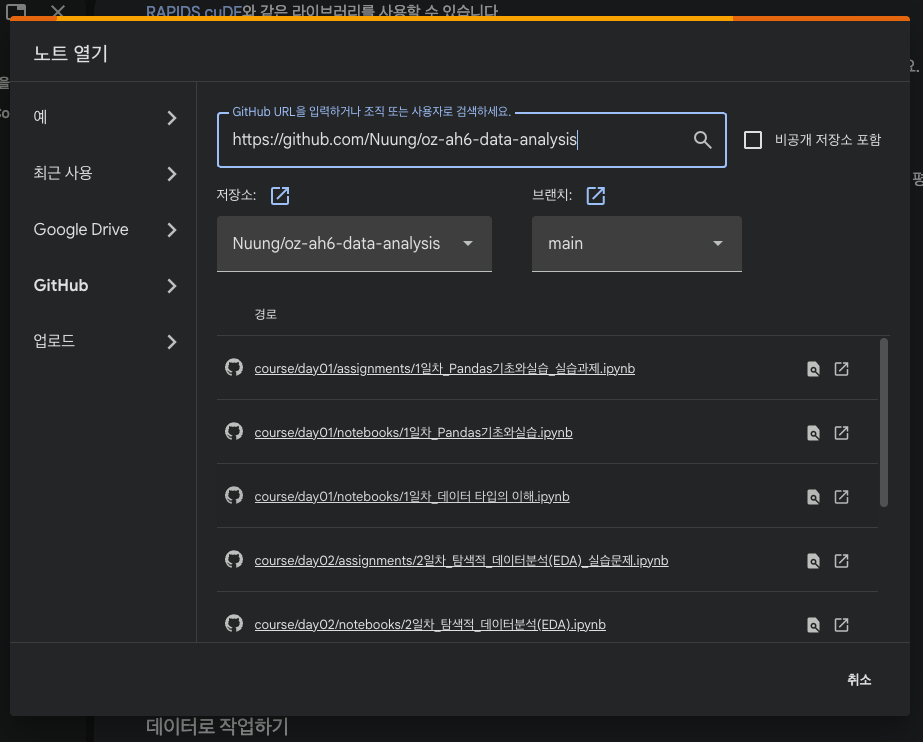
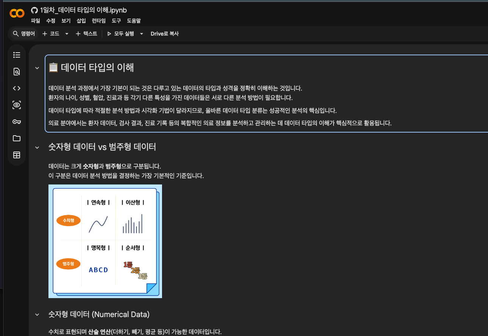

# Python을 활용한 헬스케어 데이터 분석 및 시각화

3일 동안 Python과 Colab을 사용해 헬스케어 데이터를 다루는 온라인 라이브 강의 자료입니다.
Python을 처음 접하는 비전공자도 따라올 수 있도록, 표 데이터 확인부터 Pandas 기초, EDA, 전처리, 시각화까지 순서대로 실습합니다.

- 과정: Python을 활용한 헬스케어 데이터 분석 및 시각화
- 기간: 총 3일
- 수업 시간: 10:00–15:00 KST
- 실행 환경: Google Colab 기준
- 주요 라이브러리: pandas, numpy, matplotlib, seaborn, kagglehub

## 코랩에서 사용하는 방법

강의 노트북은 Google Colab에서 바로 열어 실행합니다. 아래 순서대로 진행하세요.

1. [https://colab.research.google.com/](https://colab.research.google.com/)에 접속합니다.
2. Google 계정으로 로그인합니다.
3. 상단 메뉴에서 **파일 > 노트 열기**를 클릭합니다.



4. 열리는 창의 왼쪽 메뉴에서 **GitHub**를 클릭한 뒤, 아래 저장소 주소를 붙여넣습니다.

```text
https://github.com/Nuung/oz-ah6-data-analysis
```

그러면 아래 사진처럼 이 저장소의 노트북 목록이 표시됩니다.



5. 사용할 노트북을 클릭해서 엽니다. 노트북이 열리면 위에서부터 차례대로 셀을 실행합니다.



### 꼭 기억할 것

- 셀은 위에서 아래로 실행하세요. 중간 셀만 먼저 실행하면 이전 셀에서 만든 변수나 데이터가 없어서 오류가 날 수 있습니다.
- 실습 내용을 저장하려면 Colab 메뉴에서 **파일 > Drive에 사본 저장**을 먼저 누르세요.
- 런타임이 끊기거나 실행 순서가 꼬이면 **런타임 > 세션 다시 시작** 후 필요한 셀부터 다시 실행하면 됩니다.
- 일부 노트북은 데이터 다운로드를 위해 `!pip install kagglehub` 셀을 실행합니다. 설치가 끝난 뒤 다음 셀을 실행하세요.
- 그래프의 한글이 깨지면 시각화 노트북의 한글 폰트 세팅 셀을 먼저 실행하세요.

## 강의 노트북

### 1일차

- `course/day01/notebooks/1일차_데이터 타입의 이해.ipynb`
  숫자형/범주형 데이터, 연속형/이산형 데이터, 순서형/명목형 데이터, 타입별 분석 방법을 다룹니다.

- `course/day01/notebooks/1일차_Pandas기초와실습.ipynb`
  Series, DataFrame, CSV 입출력, 데이터 탐색, loc/iloc, 조건부 필터링, 컬럼 추가와 수정 등을 실습합니다.

- `course/day01/assignments/1일차_Pandas기초와실습_실습과제.ipynb`
  환자 예제 데이터로 DataFrame 생성, 특정 환자 조회, 조건 필터링, 기본 통계, 위험도 라벨 추가를 연습합니다.

### 2일차

- `course/day02/notebooks/2일차_탐색적_데이터분석(EDA).ipynb`
  당뇨병 건강지표 데이터를 사용해 EDA 흐름, 기술통계, 빈도분석, 교차분석, groupby, 상관관계 분석을 실습합니다.

- `course/day02/assignments/2일차_탐색적_데이터분석(EDA)_실습문제.ipynb`
  당뇨병 여부별 BMI/나이 통계, 성별·교육수준 분포, 고혈압과 당뇨병의 교차분석을 연습합니다.

### 3일차

- `course/day03/notebooks/3일차_데이터전처리.ipynb`
  결측치, 중복 데이터, 이상치, 데이터 타입 오류를 찾고 처리하는 방법을 실습합니다.

- `course/day03/notebooks/3일차_데이터시각화.ipynb`
  Matplotlib과 Seaborn으로 선 그래프, 막대 차트, countplot, histplot, boxplot, heatmap을 만들고 해석합니다.

- `course/day03/assignments/3일차_데이터전처리_실습과제.ipynb`
  심혈관 질환 예제 데이터에서 결측치 처리, 중복 제거, 이상치 처리, 날짜 타입 변환을 종합적으로 연습합니다.

## 수업에서 사용하는 데이터에 대해

수업 자료에는 교육용 예제 데이터와 공개 건강 데이터가 함께 사용됩니다.
노트북에 나오는 환자 정보, 위험도 라벨, 질병 관련 변수는 Python 데이터 분석 연습을 위한 예시입니다.

실제 진단, 치료, 의학적 판단에 사용하면 안 됩니다.

## 로컬에서 실행해야 하는 경우

수업은 Colab 기준이지만, 로컬 환경에서 실행하려면 Python 3.13 이상을 사용합니다.

uv 사용 시:

```bash
uv sync
```

pip 사용 시:

```bash
python -m pip install -r requirements.txt
```

다만 실시간 강의 중에는 환경 차이를 줄이기 위해 Colab 사용을 권장합니다.
